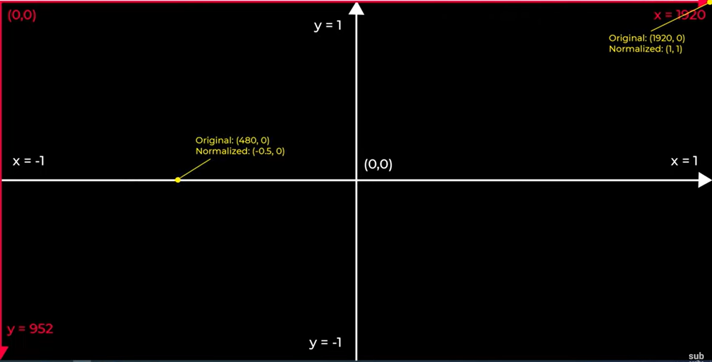

# 1

package.json dosyasının eklenmesi için

npm init -y

# 2

Execution_Policies hatası aldığın zaman

powershell -ExecutionPolicy Bypass

# 3

Bounder eklememiz gerekiyor, ama bu zorunlu değil. Kodun düzenli olmasını, bakımını ve organizasyonunu kolaylaştırıyor. Parcel yükleyebiliriz.

npm install parcel --save-dev

yada global olarak yüklemek için

npm install parcel -g

# 4

html ve script dosyalarını oluştur. Önemli nokta script'i html'e entegre ederken type="module" olmalı, yoksa hata verir.

# 5

Three.js module'ünü eklemek için

npm install three

# 6

Sayfayı run etmek ve değişikliklerin direk yansıması için

parcel ./src/index.html

# 7

Coordinate System

# 8

Kamera Türleri:

Perspective Camera: Gerçek hayattaki kameralar gibi

Ortographic Camera: 6 bileşeni var (sağ, sol, yukarı, aşağı, yakın, uzak)

perspective kamera da bir cisim uzaktan yakına geldiğinde büyür ama ortographic camera da boyut değişimi olmaz. 

# 9

Materyal Türleri: 

MeshBasicMaterial:

* Işıktan etkilenmez. Nesne, sahnede ışık olsa da olmasa da hep aynı görünür.

* Çok hafif ve hızlıdır, debug sahneler, veya flat stil için idealdir.

* Opaklık, renk, alfa (transparent) gibi basit özellkleri vardır.

MeshStandardMaterial:

* Fizik tabanlı render (PBR) materyalidir: Gerçekçi yansımalar, yüzey pürüzlüğü ve metalik özellikleri hesaplar.

* roughness ve metalness gibi parametrelerle ince ayar yapılabilir.

* Güncel projelerde en çok tercih edilen materyaldir.

MeshLambertMaterial:

* Işıktan etkilenir, ancak yumuşak ve basit gölgeleme (Lambertian shading) kullanır.

* Performans açısından daha hızlıdır, fakat daha az gerçekçidir.

* Yaygın olarak “düşük poligon” stiller ya da mobil performans isteyen sahnelerde kullanılır.

# 10

Anlık olarak parametreleri değiştirebilmek için dat.gui kullanılır. Hafif ve etkileşimli bir arayüz aracıdır. Arayüzde bir kontrol paneli oluşturur.

npm install dat.gui

# 11

directional light ile gölgelendirme eklediğimizde, gölge ortographic kameraya göre oluşur. Bu yüzden gölgede cisim yakına yada uzağa gittiğinde boyutu değişmez.

gölgenin yarım çıkmasını şu şekilde engelleriz: 

# 12

html canvas'ında normalde kırmızı çizgi şeklindedir (1920, 0). Bunu normalize ederek (1,1) yaparız. Bunu yapmamızın nedeni ise mause ile harekette daha rahat edebilmektir.

