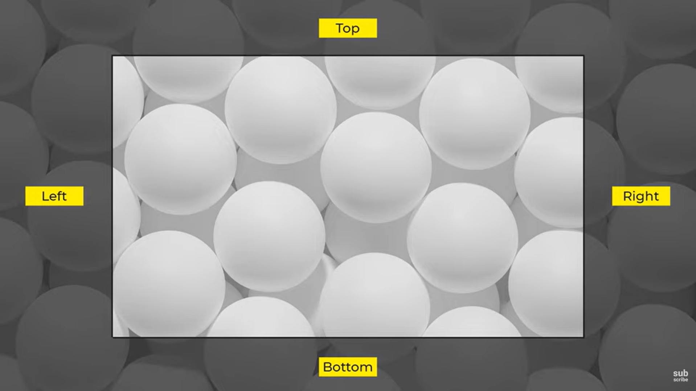
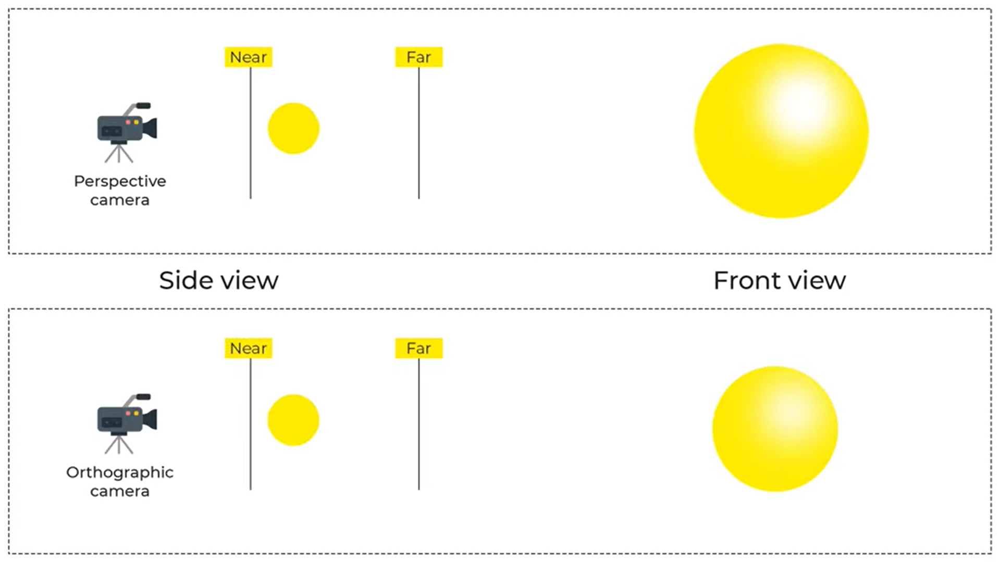

# 1

package.json dosyasının eklenmesi için

npm init -y

# 2

Execution_Policies hatası aldığın zaman

powershell -ExecutionPolicy Bypass

# 3

Bounder eklememiz gerekiyor, ama bu zorunlu değil. Kodun düzenli olmasını, bakımını ve organizasyonunu kolaylaştırıyor. Parcel yükleyebiliriz.

npm install parcel --save-dev

yada global olarak yüklemek için

npm install parcel -g

# 4

html ve script dosyalarını oluştur. Önemli nokta script'i html'e entegre ederken type="module" olmalı, yoksa hata verir.

# 5

Three.js module'ünü eklemek için

npm install three

# 6

Sayfayı run etmek ve değişikliklerin direk yansıması için

parcel ./src/index.html

# 7

Coordinate System

# 8

Kamera Türleri:

Perspective Camera: Gerçek hayattaki kameralar gibi

Ortographic Camera: 6 bileşeni var (sağ, sol, yukarı, aşağı, yakın, uzak)

perspective kamera da bir cisim uzaktan yakına geldiğinde büyür ama ortographic camera da boyut değişimi olmaz. 
